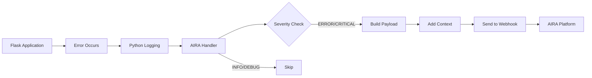

# 🔧 AIRA Integration - Technical Specification

## Overview

This document provides detailed technical specifications for integrating AIRA error monitoring into the Flask-based e-commerce platform.

---

## 🎯 Integration Goals

1. **Automatic Error Capture**: All exceptions automatically logged to AIRA
2. **Rich Context**: Include user, request, and system context
3. **Severity Classification**: Intelligent P0/P1/P2 assignment
4. **Non-blocking**: Errors in AIRA shouldn't break the application
5. **Testable**: Easy-to-trigger error scenarios for demonstration

---

## 🏗️ AIRA Handler Architecture



---

## 📦 AIRA Handler Implementation

### Class Structure

```python
class AIRAHandler(logging.Handler):
    """
    Custom logging handler that sends error logs to AIRA webhook.
    
    Features:
    - Automatic severity classification
    - Rich contextual information
    - Async request handling
    - Retry logic with exponential backoff
    - Rate limiting to prevent spam
    """
    
    def __init__(self, webhook_url: str, api_key: str):
        """Initialize AIRA handler with webhook configuration."""
        
    def emit(self, record: logging.LogRecord):
        """Process and send log record to AIRA."""
        
    def _get_severity(self, levelno: int) -> str:
        """Map Python log level to AIRA severity."""
        
    def _build_payload(self, record: logging.LogRecord) -> dict:
        """Construct AIRA webhook payload."""
        
    def _get_context(self) -> dict:
        """Extract request and user context."""
        
    def _send_to_aira(self, payload: dict):
        """Send payload to AIRA webhook with retry logic."""
```

### Severity Mapping

| Python Level | Numeric | AIRA Severity | Use Case |
|--------------|---------|---------------|----------|
| CRITICAL | 50 | P0 | System failures, database crashes |
| ERROR | 40 | P1 | Payment failures, auth errors |
| WARNING | 30 | P2 | Validation errors, stock issues |
| INFO | 20 | - | Not sent to AIRA |
| DEBUG | 10 | - | Not sent to AIRA |

### Context Extraction

The handler extracts the following context:

```python
context = {
    # User Information
    "user_id": g.user_id if hasattr(g, 'user_id') else 'anonymous',
    "user_email": g.user_email if hasattr(g, 'user_email') else None,
    
    # Request Information
    "endpoint": request.endpoint,
    "method": request.method,
    "path": request.path,
    "url": request.url,
    "remote_addr": request.remote_addr,
    "user_agent": request.headers.get('User-Agent'),
    
    # Request Data (sanitized)
    "query_params": dict(request.args),
    "request_body": self._sanitize_body(request.get_json(silent=True)),
    
    # Error Information
    "error_type": record.exc_info[0].__name__ if record.exc_info else None,
    "module": record.module,
    "function": record.funcName,
    "line_number": record.lineno,
    
    # System Information
    "python_version": sys.version,
    "timestamp": datetime.utcnow().isoformat()
}
```

---

## 🔒 Security & Privacy

### Data Sanitization

Sensitive data is removed before sending to AIRA:

```python
SENSITIVE_FIELDS = [
    'password', 'password_hash', 'token', 'api_key',
    'secret', 'credit_card', 'cvv', 'ssn'
]

def _sanitize_body(self, data: dict) -> dict:
    """Remove sensitive fields from request body."""
    if not data:
        return {}
    
    sanitized = {}
    for key, value in data.items():
        if any(sensitive in key.lower() for sensitive in SENSITIVE_FIELDS):
            sanitized[key] = '***REDACTED***'
        elif isinstance(value, dict):
            sanitized[key] = self._sanitize_body(value)
        else:
            sanitized[key] = value
    
    return sanitized
```

### Rate Limiting

Prevent AIRA spam with token bucket algorithm:

```python
class RateLimiter:
    def __init__(self, max_requests: int = 100, time_window: int = 60):
        self.max_requests = max_requests
        self.time_window = time_window
        self.requests = []
    
    def allow_request(self) -> bool:
        now = time.time()
        # Remove old requests outside time window
        self.requests = [req for req in self.requests 
                        if now - req < self.time_window]
        
        if len(self.requests) < self.max_requests:
            self.requests.append(now)
            return True
        return False
```

---

## 📡 Webhook Communication

### Request Format

```http
POST /webhook HTTP/1.1
Host: your-aira-instance.com
Content-Type: application/json
X-API-Key: aira_your_api_key_here

{
  "message": "Payment processing failed for order #12345",
  "stack_trace": "Traceback (most recent call last):\n  File...",
  "severity": "P1",
  "timestamp": "2026-05-17T08:49:37.265Z",
  "context": {
    "user_id": "user_123",
    "user_email": "user@example.com",
    "endpoint": "api.create_order",
    "method": "POST",
    "path": "/api/orders",
    "url": "http://localhost:5000/api/orders",
    "remote_addr": "127.0.0.1",
    "user_agent": "Mozilla/5.0...",
    "query_params": {},
    "request_body": {
      "cart_items": [1, 2, 3],
      "payment_method": "credit_card"
    },
    "error_type": "PaymentError",
    "module": "order_routes",
    "function": "create_order",
    "line_number": 45,
    "python_version": "3.10.0",
    "timestamp": "2026-05-17T08:49:37.265Z"
  }
}
```

### Retry Logic

Exponential backoff for failed webhook requests:

```python
def _send_with_retry(self, payload: dict, max_retries: int = 3):
    """Send payload with exponential backoff retry."""
    for attempt in range(max_retries):
        try:
            response = requests.post(
                self.webhook_url,
                json=payload,
                headers={
                    'Content-Type': 'application/json',
                    'X-API-Key': self.api_key
                },
                timeout=5
            )
            
            if response.status_code == 200:
                return True
            
            # Exponential backoff: 1s, 2s, 4s
            time.sleep(2 ** attempt)
            
        except requests.exceptions.RequestException as e:
            if attempt == max_retries - 1:
                # Log locally but don't raise
                print(f"AIRA webhook failed after {max_retries} attempts: {e}")
                return False
            time.sleep(2 ** attempt)
    
    return False
```

---

## 🧪 Error Scenarios

### 1. Database Connection Failure (P0)

**Trigger**: `GET /api/test/error/database`

```python
@test_bp.route('/error/database')
def test_database_error():
    """Simulate critical database failure."""
    try:
        # Close database connection
        db.session.close()
        db.engine.dispose()
        
        # Attempt query that will fail
        User.query.first()
        
    except Exception as e:
        logger.critical(
            f"Database connection failed: {str(e)}",
            exc_info=True
        )
        return jsonify({
            'error': 'Database connection failed',
            'severity': 'P0'
        }), 500
```

**Expected AIRA Payload**:
- Severity: P0
- Message: "Database connection failed"
- Stack trace: Full SQLAlchemy error
- Context: Request details

---

### 2. Payment Processing Error (P1)

**Trigger**: `POST /api/test/error/payment`

```python
@test_bp.route('/error/payment', methods=['POST'])
@jwt_required()
def test_payment_error():
    """Simulate payment gateway failure."""
    try:
        # Simulate payment processing
        amount = request.json.get('amount', 100.00)
        
        # Intentionally fail
        raise PaymentError(
            f"Payment gateway timeout for amount ${amount}"
        )
        
    except PaymentError as e:
        logger.error(
            f"Payment processing failed: {str(e)}",
            exc_info=True
        )
        return jsonify({
            'error': 'Payment processing failed',
            'severity': 'P1'
        }), 402
```

**Expected AIRA Payload**:
- Severity: P1
- Message: "Payment processing failed"
- Context: User ID, amount, payment method

---

### 3. Invalid Product ID (P2)

**Trigger**: `GET /api/books/99999`

```python
@book_bp.route('/<int:book_id>')
def get_book(book_id):
    """Get book by ID with error handling."""
    try:
        book = Book.query.get(book_id)
        
        if not book:
            raise ValueError(f"Book with ID {book_id} not found")
        
        return jsonify(book.to_dict())
        
    except ValueError as e:
        logger.warning(
            f"Invalid book ID requested: {str(e)}",
            exc_info=True
        )
        return jsonify({
            'error': 'Book not found',
            'severity': 'P2'
        }), 404
```

**Expected AIRA Payload**:
- Severity: P2
- Message: "Invalid book ID requested"
- Context: Requested book ID

---

### 4. Stock Validation Error (P2)

**Trigger**: `POST /api/test/error/stock`

```python
@test_bp.route('/error/stock', methods=['POST'])
@jwt_required()
def test_stock_error():
    """Simulate insufficient stock error."""
    try:
        book_id = request.json.get('book_id', 1)
        quantity = request.json.get('quantity', 100)
        
        book = Book.query.get(book_id)
        
        if book.stock < quantity:
            raise StockError(
                f"Insufficient stock for book '{book.title}'. "
                f"Requested: {quantity}, Available: {book.stock}"
            )
        
    except StockError as e:
        logger.warning(
            f"Stock validation failed: {str(e)}",
            exc_info=True
        )
        return jsonify({
            'error': 'Insufficient stock',
            'severity': 'P2'
        }), 400
```

**Expected AIRA Payload**:
- Severity: P2
- Message: "Stock validation failed"
- Context: Book ID, requested quantity, available stock

---

### 5. Authentication Failure (P1)

**Trigger**: `GET /api/test/error/auth`

```python
@test_bp.route('/error/auth')
def test_auth_error():
    """Simulate authentication failure."""
    try:
        # Simulate invalid token
        raise AuthenticationError("Invalid or expired JWT token")
        
    except AuthenticationError as e:
        logger.error(
            f"Authentication failed: {str(e)}",
            exc_info=True
        )
        return jsonify({
            'error': 'Authentication failed',
            'severity': 'P1'
        }), 401
```

**Expected AIRA Payload**:
- Severity: P1
- Message: "Authentication failed"
- Context: Request path, attempted endpoint

---

### 6. Rate Limit Exceeded (P2)

**Trigger**: Multiple rapid requests to any endpoint

```python
from flask_limiter import Limiter

limiter = Limiter(
    app,
    key_func=lambda: request.remote_addr,
    default_limits=["100 per minute"]
)

@app.errorhandler(429)
def rate_limit_exceeded(e):
    """Handle rate limit errors."""
    logger.warning(
        f"Rate limit exceeded for {request.remote_addr}",
        exc_info=True
    )
    return jsonify({
        'error': 'Rate limit exceeded',
        'severity': 'P2'
    }), 429
```

**Expected AIRA Payload**:
- Severity: P2
- Message: "Rate limit exceeded"
- Context: IP address, endpoint

---

## 🔧 Configuration

### Environment Variables

```env
# AIRA Configuration
AIRA_WEBHOOK_URL=https://your-aira-instance.com/webhook
AIRA_API_KEY=aira_your_api_key_here
AIRA_ENABLED=true
AIRA_LOG_LEVEL=ERROR
AIRA_MAX_RETRIES=3
AIRA_TIMEOUT=5
AIRA_RATE_LIMIT=100
```

### Flask App Configuration

```python
# config.py
import os
from dotenv import load_dotenv

load_dotenv()

class Config:
    # AIRA Configuration
    AIRA_WEBHOOK_URL = os.getenv('AIRA_WEBHOOK_URL')
    AIRA_API_KEY = os.getenv('AIRA_API_KEY')
    AIRA_ENABLED = os.getenv('AIRA_ENABLED', 'true').lower() == 'true'
    AIRA_LOG_LEVEL = os.getenv('AIRA_LOG_LEVEL', 'ERROR')
    AIRA_MAX_RETRIES = int(os.getenv('AIRA_MAX_RETRIES', 3))
    AIRA_TIMEOUT = int(os.getenv('AIRA_TIMEOUT', 5))
    AIRA_RATE_LIMIT = int(os.getenv('AIRA_RATE_LIMIT', 100))
```

---

## 📊 Monitoring & Metrics

### Metrics to Track

1. **Error Rate**: Errors per minute/hour
2. **Severity Distribution**: P0/P1/P2 breakdown
3. **Response Time**: AIRA webhook latency
4. **Success Rate**: Successful webhook deliveries
5. **Most Common Errors**: Top error types

### Health Check Endpoint

```python
@app.route('/api/health')
def health_check():
    """Health check with AIRA status."""
    aira_status = 'healthy'
    
    try:
        # Test AIRA connection
        response = requests.get(
            f"{Config.AIRA_WEBHOOK_URL}/health",
            headers={'X-API-Key': Config.AIRA_API_KEY},
            timeout=2
        )
        if response.status_code != 200:
            aira_status = 'degraded'
    except:
        aira_status = 'unavailable'
    
    return jsonify({
        'status': 'healthy',
        'aira_integration': aira_status,
        'timestamp': datetime.utcnow().isoformat()
    })
```

---

## 🧪 Testing AIRA Integration

### Manual Testing Steps

1. **Start the application**
   ```bash
   python app.py
   ```

2. **Trigger each error scenario**
   ```bash
   # Database error
   curl http://localhost:5000/api/test/error/database
   
   # Payment error
   curl -X POST http://localhost:5000/api/test/error/payment \
     -H "Authorization: Bearer YOUR_TOKEN" \
     -H "Content-Type: application/json" \
     -d '{"amount": 100.00}'
   
   # Invalid book ID
   curl http://localhost:5000/api/books/99999
   
   # Stock error
   curl -X POST http://localhost:5000/api/test/error/stock \
     -H "Authorization: Bearer YOUR_TOKEN" \
     -H "Content-Type: application/json" \
     -d '{"book_id": 1, "quantity": 1000}'
   
   # Auth error
   curl http://localhost:5000/api/test/error/auth
   ```

3. **Verify in AIRA dashboard**
   - Check that errors appear
   - Verify severity levels
   - Confirm context is included
   - Check stack traces

### Automated Testing

```python
# test_aira_integration.py
import unittest
from unittest.mock import patch, MagicMock

class TestAIRAIntegration(unittest.TestCase):
    
    @patch('requests.post')
    def test_aira_handler_sends_error(self, mock_post):
        """Test that AIRA handler sends errors correctly."""
        mock_post.return_value.status_code = 200
        
        # Trigger error
        logger.error("Test error", exc_info=True)
        
        # Verify webhook was called
        self.assertTrue(mock_post.called)
        
        # Verify payload structure
        call_args = mock_post.call_args
        payload = call_args[1]['json']
        
        self.assertIn('message', payload)
        self.assertIn('severity', payload)
        self.assertIn('context', payload)
    
    def test_severity_mapping(self):
        """Test severity level mapping."""
        handler = AIRAHandler(webhook_url='test', api_key='test')
        
        self.assertEqual(handler._get_severity(logging.CRITICAL), 'P0')
        self.assertEqual(handler._get_severity(logging.ERROR), 'P1')
        self.assertEqual(handler._get_severity(logging.WARNING), 'P2')
```

---

## 📝 Best Practices

1. **Always include context**: More context = faster debugging
2. **Use appropriate severity**: Don't over-escalate warnings
3. **Sanitize sensitive data**: Never log passwords or tokens
4. **Handle AIRA failures gracefully**: Don't let AIRA break your app
5. **Rate limit**: Prevent AIRA spam during cascading failures
6. **Test regularly**: Ensure AIRA integration stays functional
7. **Monitor AIRA health**: Track webhook success rate

---

## 🚀 Deployment Checklist

- [ ] AIRA webhook URL configured
- [ ] API key set in environment variables
- [ ] Rate limiting enabled
- [ ] Sensitive data sanitization tested
- [ ] All error scenarios tested
- [ ] Health check endpoint working
- [ ] Documentation updated
- [ ] Team trained on AIRA dashboard

---

## 📞 Support & Troubleshooting

### Common Issues

**Issue**: Errors not appearing in AIRA
- Check webhook URL is correct
- Verify API key is valid
- Check network connectivity
- Review application logs

**Issue**: Too many errors being sent
- Increase rate limit threshold
- Adjust log level (ERROR vs WARNING)
- Review error handling logic

**Issue**: Missing context in errors
- Verify Flask request context is available
- Check user authentication is working
- Review context extraction logic
