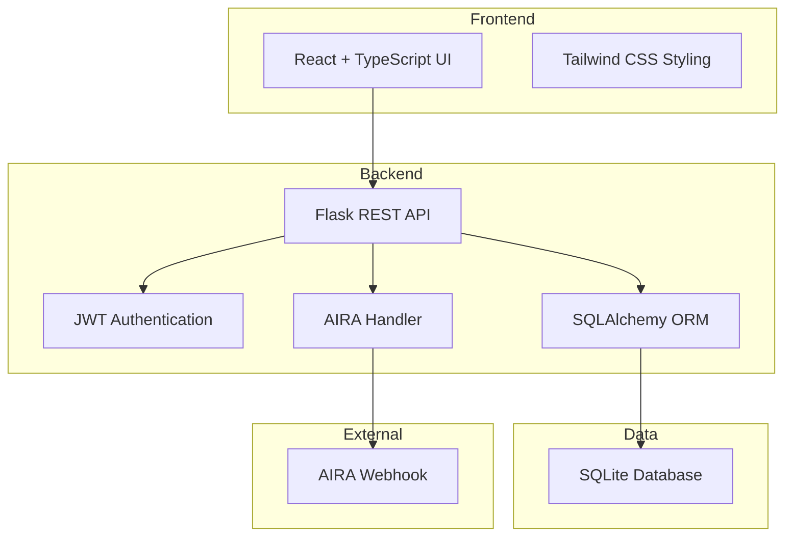

# 📋 E-Commerce Platform with AIRA Integration - Implementation Plan

## 🎯 Project Overview

**Goal**: Build a demonstration/proof-of-concept e-commerce bookstore platform with comprehensive AIRA error monitoring integration.

**Focus**: Showcase AIRA's error monitoring capabilities through various error scenarios in a realistic application context.

---

## 🏗️ Architecture Overview



---

## 📁 Project Structure

```
bookstore/
├── backend/
│   ├── app.py                    # Main Flask application entry point
│   ├── config.py                 # Configuration management
│   ├── models.py                 # SQLAlchemy database models
│   ├── auth.py                   # JWT authentication utilities
│   ├── aira_handler.py           # AIRA logging integration
│   ├── database.py               # Database initialization
│   ├── seed_data.py              # Sample data seeding script
│   ├── routes/
│   │   ├── __init__.py
│   │   ├── auth_routes.py        # User registration/login
│   │   ├── book_routes.py        # Book CRUD operations
│   │   ├── cart_routes.py        # Shopping cart management
│   │   ├── order_routes.py       # Order processing
│   │   └── test_routes.py        # Error testing endpoints
│   ├── requirements.txt          # Python dependencies
│   ├── .env.example              # Environment variables template
│   └── .gitignore
├── frontend/
│   ├── src/
│   │   ├── components/
│   │   │   ├── Navbar.tsx
│   │   │   ├── BookCard.tsx
│   │   │   ├── CartItem.tsx
│   │   │   └── ProtectedRoute.tsx
│   │   ├── pages/
│   │   │   ├── Home.tsx
│   │   │   ├── BookDetail.tsx
│   │   │   ├── Cart.tsx
│   │   │   ├── Checkout.tsx
│   │   │   ├── Login.tsx
│   │   │   ├── Register.tsx
│   │   │   └── OrderHistory.tsx
│   │   ├── services/
│   │   │   ├── api.ts            # API client
│   │   │   └── auth.ts           # Auth utilities
│   │   ├── types/
│   │   │   └── index.ts          # TypeScript interfaces
│   │   ├── App.tsx
│   │   ├── main.tsx
│   │   └── index.css
│   ├── package.json
│   ├── tsconfig.json
│   ├── vite.config.ts
│   ├── tailwind.config.js
│   └── postcss.config.js
├── README.md                      # Main documentation
├── AIRA_INTEGRATION.md           # AIRA setup guide
└── TESTING_GUIDE.md              # Error scenario testing
```

---

## 🗄️ Database Schema

### Users Table
```sql
CREATE TABLE users (
    id INTEGER PRIMARY KEY AUTOINCREMENT,
    email VARCHAR(120) UNIQUE NOT NULL,
    username VARCHAR(80) UNIQUE NOT NULL,
    password_hash VARCHAR(255) NOT NULL,
    created_at DATETIME DEFAULT CURRENT_TIMESTAMP
);
```

### Books Table
```sql
CREATE TABLE books (
    id INTEGER PRIMARY KEY AUTOINCREMENT,
    title VARCHAR(200) NOT NULL,
    author VARCHAR(100) NOT NULL,
    price DECIMAL(10, 2) NOT NULL,
    stock INTEGER NOT NULL DEFAULT 0,
    description TEXT,
    cover_image VARCHAR(255),
    isbn VARCHAR(13) UNIQUE,
    created_at DATETIME DEFAULT CURRENT_TIMESTAMP
);
```

### Orders Table
```sql
CREATE TABLE orders (
    id INTEGER PRIMARY KEY AUTOINCREMENT,
    user_id INTEGER NOT NULL,
    total_amount DECIMAL(10, 2) NOT NULL,
    status VARCHAR(20) DEFAULT 'pending',
    created_at DATETIME DEFAULT CURRENT_TIMESTAMP,
    FOREIGN KEY (user_id) REFERENCES users(id)
);
```

### OrderItems Table
```sql
CREATE TABLE order_items (
    id INTEGER PRIMARY KEY AUTOINCREMENT,
    order_id INTEGER NOT NULL,
    book_id INTEGER NOT NULL,
    quantity INTEGER NOT NULL,
    price DECIMAL(10, 2) NOT NULL,
    FOREIGN KEY (order_id) REFERENCES orders(id),
    FOREIGN KEY (book_id) REFERENCES books(id)
);
```

### Cart Table
```sql
CREATE TABLE cart (
    id INTEGER PRIMARY KEY AUTOINCREMENT,
    user_id INTEGER NOT NULL,
    book_id INTEGER NOT NULL,
    quantity INTEGER NOT NULL DEFAULT 1,
    created_at DATETIME DEFAULT CURRENT_TIMESTAMP,
    FOREIGN KEY (user_id) REFERENCES users(id),
    FOREIGN KEY (book_id) REFERENCES books(id),
    UNIQUE(user_id, book_id)
);
```

---

## 🔌 API Endpoints

### Authentication
- `POST /api/auth/register` - User registration
- `POST /api/auth/login` - User login
- `GET /api/auth/me` - Get current user (protected)

### Books
- `GET /api/books` - List all books (with pagination, search, filters)
- `GET /api/books/<id>` - Get book details
- `POST /api/books` - Create book (admin only)
- `PUT /api/books/<id>` - Update book (admin only)
- `DELETE /api/books/<id>` - Delete book (admin only)

### Cart
- `GET /api/cart` - Get user's cart (protected)
- `POST /api/cart` - Add item to cart (protected)
- `PUT /api/cart/<id>` - Update cart item quantity (protected)
- `DELETE /api/cart/<id>` - Remove item from cart (protected)
- `DELETE /api/cart` - Clear cart (protected)

### Orders
- `GET /api/orders` - Get user's orders (protected)
- `GET /api/orders/<id>` - Get order details (protected)
- `POST /api/orders` - Create order from cart (protected)

### Testing (Error Scenarios)
- `GET /api/test/error/database` - Simulate database error (P0)
- `GET /api/test/error/payment` - Simulate payment error (P1)
- `GET /api/test/error/validation` - Simulate validation error (P2)
- `GET /api/test/error/auth` - Simulate auth error (P1)
- `GET /api/test/error/stock` - Simulate stock error (P2)
- `GET /api/test/error/generic` - Generic exception

---

## 🚨 AIRA Integration Details

### Error Severity Mapping
- **P0 (Critical)**: Database failures, system crashes
- **P1 (High)**: Payment errors, authentication failures
- **P2 (Medium)**: Validation errors, stock issues, rate limits

### AIRA Handler Implementation

The AIRA handler will capture:
1. **Error Message**: Clear description of what went wrong
2. **Stack Trace**: Full traceback for debugging
3. **Severity Level**: P0, P1, or P2 based on error type
4. **Timestamp**: ISO 8601 format
5. **Context**:
   - User ID (if authenticated)
   - Request endpoint
   - HTTP method
   - Request path
   - User agent
   - Request body (sanitized)

### Payload Format
```json
{
  "message": "Database connection failed",
  "stack_trace": "Traceback (most recent call last)...",
  "severity": "P0",
  "timestamp": "2026-05-17T08:49:37.265Z",
  "context": {
    "user_id": "user_123",
    "endpoint": "api.create_order",
    "method": "POST",
    "path": "/api/orders",
    "user_agent": "Mozilla/5.0...",
    "error_type": "DatabaseError"
  }
}
```

### Error Scenarios to Demonstrate

1. **Database Connection Failure (P0)**
   - Simulate by closing database connection
   - Trigger: `/api/test/error/database`

2. **Payment Processing Error (P1)**
   - Simulate payment gateway timeout
   - Trigger: `/api/test/error/payment`

3. **Invalid Product ID (P2)**
   - Request non-existent book
   - Trigger: `GET /api/books/99999`

4. **Stock Validation Error (P2)**
   - Attempt to order more than available stock
   - Trigger: `/api/test/error/stock`

5. **Authentication Failure (P1)**
   - Invalid JWT token
   - Trigger: `/api/test/error/auth`

6. **Rate Limit Exceeded (P2)**
   - Too many requests in short time
   - Trigger: Multiple rapid requests

---

## 🛠️ Technology Stack

### Backend
- **Python 3.10+**
- **Flask 3.0+** - Web framework
- **Flask-CORS** - Cross-origin resource sharing
- **Flask-JWT-Extended** - JWT authentication
- **SQLAlchemy 2.0+** - ORM
- **Werkzeug** - Password hashing
- **Requests** - HTTP client for AIRA webhook
- **Python-dotenv** - Environment variable management

### Frontend
- **React 18+** - UI library
- **TypeScript 5+** - Type safety
- **Vite** - Build tool
- **Tailwind CSS 3+** - Styling
- **React Router 6+** - Routing
- **Axios** - HTTP client
- **React Hook Form** - Form handling
- **Zod** - Schema validation

---

## 🔐 Security Considerations

1. **Password Hashing**: Using Werkzeug's `generate_password_hash`
2. **JWT Tokens**: Secure token generation with expiration
3. **CORS Configuration**: Restricted to frontend origin
4. **Input Validation**: Sanitize all user inputs
5. **SQL Injection Prevention**: Using SQLAlchemy ORM
6. **Rate Limiting**: Prevent abuse of API endpoints
7. **Environment Variables**: Sensitive data in `.env` file

---

## 📊 Sample Data

### Books (20 sample books)
- Classic literature (Pride and Prejudice, 1984, etc.)
- Modern fiction (The Hunger Games, Harry Potter, etc.)
- Non-fiction (Sapiens, Educated, etc.)
- Technical books (Clean Code, Design Patterns, etc.)

### Users (3 test users)
- Regular user: `user@example.com` / `password123`
- Admin user: `admin@example.com` / `admin123`
- Test user: `test@example.com` / `test123`

---

## 🧪 Testing Strategy

### Manual Testing
1. User registration and login flow
2. Browse books and search functionality
3. Add items to cart
4. Checkout process
5. View order history
6. Trigger each error scenario

### Error Testing Endpoints
Each test endpoint will:
- Log the error to AIRA
- Return appropriate HTTP status code
- Include error details in response
- Demonstrate different severity levels

---

## 📝 Implementation Phases

### Phase 1: Backend Foundation
1. Set up Flask application structure
2. Configure database with SQLAlchemy
3. Implement AIRA handler
4. Create database models
5. Set up JWT authentication

### Phase 2: API Development
1. Build authentication routes
2. Implement book management routes
3. Create cart operations
4. Develop order processing
5. Add error testing endpoints

### Phase 3: Frontend Development
1. Set up React + TypeScript + Vite
2. Configure Tailwind CSS
3. Create authentication pages
4. Build book browsing interface
5. Implement cart and checkout

### Phase 4: Integration & Testing
1. Connect frontend to backend
2. Test all user flows
3. Verify AIRA integration
4. Test error scenarios
5. Create documentation

---

## 🚀 Deployment Considerations

### Environment Variables Required
```env
# Flask Configuration
FLASK_SECRET_KEY=your-secret-key-here
JWT_SECRET_KEY=your-jwt-secret-here
FLASK_ENV=development

# Database
DATABASE_URL=sqlite:///bookstore.db

# AIRA Integration
AIRA_WEBHOOK_URL=https://your-aira-instance.com/webhook
AIRA_API_KEY=aira_your_api_key_here

# CORS
FRONTEND_URL=http://localhost:5173
```

### Running the Application
```bash
# Backend
cd backend
python -m venv venv
source venv/bin/activate  # Windows: venv\Scripts\activate
pip install -r requirements.txt
python seed_data.py  # Seed database
python app.py

# Frontend
cd frontend
npm install
npm run dev
```

---

## 📚 Documentation Deliverables

1. **README.md** - Project overview and quick start
2. **AIRA_INTEGRATION.md** - Detailed AIRA setup guide
3. **TESTING_GUIDE.md** - How to test error scenarios
4. **API_DOCUMENTATION.md** - Complete API reference
5. **IMPLEMENTATION_PLAN.md** - This document

---

## ✅ Success Criteria

- [ ] All API endpoints functional
- [ ] AIRA handler successfully sends errors to webhook
- [ ] All 6 error scenarios testable
- [ ] Frontend displays all pages correctly
- [ ] User can complete full purchase flow
- [ ] Documentation is clear and complete
- [ ] Sample data is seeded
- [ ] Environment variables are documented

---

## 🎯 Key Focus Areas for AIRA Demo

1. **Error Diversity**: Showcase different error types and severities
2. **Context Richness**: Include comprehensive error context
3. **Real-world Scenarios**: Use realistic e-commerce error cases
4. **Easy Testing**: Simple endpoints to trigger each error type
5. **Clear Documentation**: Guide users through testing process

---

## 📞 Next Steps

After plan approval, switch to **Code mode** to begin implementation following this structure:

1. Create project directories
2. Set up backend with AIRA integration
3. Build database models and seed data
4. Implement API routes
5. Create frontend application
6. Write comprehensive documentation
7. Test all error scenarios
