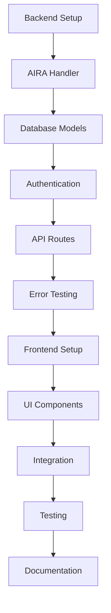

# 📋 Planning Summary - E-Commerce Platform with AIRA Integration

## 🎯 Project Goal

Build a **demonstration/proof-of-concept** e-commerce bookstore platform that showcases AIRA's error monitoring capabilities through realistic error scenarios.

---

## ✅ Planning Phase Complete

The planning phase has been completed with comprehensive documentation covering:

### 1. **Implementation Plan** ([IMPLEMENTATION_PLAN.md](./IMPLEMENTATION_PLAN.md))
   - Complete project architecture
   - Detailed file structure
   - Database schema design
   - API endpoint specifications
   - Technology stack breakdown
   - Implementation phases
   - Success criteria

### 2. **AIRA Technical Specification** ([AIRA_TECHNICAL_SPEC.md](./AIRA_TECHNICAL_SPEC.md))
   - AIRA handler architecture
   - Severity mapping (P0/P1/P2)
   - Context extraction strategy
   - Security and data sanitization
   - Webhook communication protocol
   - 6 detailed error scenarios
   - Configuration guidelines
   - Testing strategies

### 3. **Testing Guide** ([TESTING_GUIDE.md](./TESTING_GUIDE.md))
   - Step-by-step testing instructions
   - All 6 error scenarios with examples
   - cURL commands for each test
   - Expected responses and AIRA payloads
   - Verification checklist
   - Troubleshooting guide
   - Advanced testing scenarios

### 4. **Main README** ([README.md](./README.md))
   - Project overview
   - Quick start guide
   - Technology stack
   - API documentation
   - Configuration instructions
   - Security features
   - Troubleshooting section

---

## 🏗️ Architecture Overview

```
Frontend (React + TypeScript)
    ↓
Backend (Flask + Python)
    ↓
Database (SQLite)
    ↓
AIRA Platform (Error Monitoring)
```

### Key Components

1. **Backend (Python Flask)**
   - RESTful API with JWT authentication
   - SQLAlchemy ORM for database operations
   - Custom AIRA logging handler
   - 6 error testing endpoints
   - CORS-enabled for frontend

2. **Frontend (React + TypeScript)**
   - Modern UI with Tailwind CSS
   - Protected routes with authentication
   - Shopping cart functionality
   - Order management
   - Responsive design

3. **AIRA Integration**
   - Automatic error capture
   - Rich contextual information
   - Severity classification (P0/P1/P2)
   - Non-blocking webhook calls
   - Retry logic with exponential backoff

---

## 📊 Error Scenarios Planned

| # | Scenario | Severity | Purpose |
|---|----------|----------|---------|
| 1 | Database Connection Failure | P0 | Critical system failure |
| 2 | Payment Processing Error | P1 | High-priority business logic |
| 3 | Authentication Failure | P1 | Security-related error |
| 4 | Stock Validation Error | P2 | Business rule violation |
| 5 | Invalid Product ID | P2 | User input error |
| 6 | Validation Error | P2 | Data validation failure |

---

## 📁 Project Structure

```
bookstore/
├── backend/                      # Python Flask backend
│   ├── app.py                   # Main application
│   ├── aira_handler.py          # ⭐ AIRA integration
│   ├── models.py                # Database models
│   ├── auth.py                  # JWT authentication
│   ├── config.py                # Configuration
│   ├── routes/                  # API routes
│   │   ├── auth_routes.py
│   │   ├── book_routes.py
│   │   ├── cart_routes.py
│   │   ├── order_routes.py
│   │   └── test_routes.py      # ⭐ Error testing
│   └── requirements.txt
├── frontend/                     # React TypeScript frontend
│   ├── src/
│   │   ├── components/
│   │   ├── pages/
│   │   ├── services/
│   │   └── types/
│   └── package.json
└── docs/                         # Documentation
    ├── README.md
    ├── IMPLEMENTATION_PLAN.md
    ├── AIRA_TECHNICAL_SPEC.md
    └── TESTING_GUIDE.md
```

---

## 🔑 Key Features

### E-Commerce Functionality
- ✅ User registration and authentication
- ✅ Book catalog with search/filters
- ✅ Shopping cart management
- ✅ Order processing
- ✅ Payment simulation
- ✅ Order history

### AIRA Integration Features
- ✅ Automatic error capture
- ✅ Severity classification
- ✅ Rich context (user, request, system)
- ✅ Stack trace inclusion
- ✅ Sensitive data sanitization
- ✅ Rate limiting
- ✅ Retry logic
- ✅ Non-blocking operation

---

## 🛠️ Technology Stack

### Backend
- Python 3.10+
- Flask 3.0+
- SQLAlchemy 2.0+
- Flask-JWT-Extended
- Flask-CORS
- Requests (for AIRA webhook)

### Frontend
- React 18+
- TypeScript 5+
- Vite
- Tailwind CSS 3+
- React Router 6+
- Axios

### Database
- SQLite (development)
- Easily upgradable to PostgreSQL/MySQL

---

## 📋 Implementation Checklist

### Phase 1: Backend Foundation ⏳
- [ ] Set up Flask application structure
- [ ] Configure database with SQLAlchemy
- [ ] Implement AIRA handler class
- [ ] Create database models
- [ ] Set up JWT authentication

### Phase 2: API Development ⏳
- [ ] Build authentication routes
- [ ] Implement book management routes
- [ ] Create cart operations
- [ ] Develop order processing
- [ ] Add error testing endpoints

### Phase 3: Frontend Development ⏳
- [ ] Set up React + TypeScript + Vite
- [ ] Configure Tailwind CSS
- [ ] Create authentication pages
- [ ] Build book browsing interface
- [ ] Implement cart and checkout

### Phase 4: Integration & Testing ⏳
- [ ] Connect frontend to backend
- [ ] Test all user flows
- [ ] Verify AIRA integration
- [ ] Test all 6 error scenarios
- [ ] Finalize documentation

---

## 🎯 Success Criteria

The project will be considered successful when:

1. ✅ All API endpoints are functional
2. ✅ AIRA handler successfully sends errors to webhook
3. ✅ All 6 error scenarios are testable
4. ✅ Frontend displays all pages correctly
5. ✅ Users can complete full purchase flow
6. ✅ Documentation is clear and complete
7. ✅ Sample data is seeded
8. ✅ Environment variables are documented

---

## 🚀 Next Steps

### Immediate Actions

1. **Review Planning Documents**
   - Read through all documentation
   - Understand the architecture
   - Clarify any questions

2. **Prepare AIRA Configuration**
   - Obtain AIRA webhook URL
   - Get AIRA API key
   - Test AIRA connectivity

3. **Switch to Code Mode**
   - Begin implementation
   - Follow the implementation plan
   - Build incrementally

### Implementation Order



---

## 📝 Key Decisions Made

### 1. **Focus on AIRA Demonstration**
   - Prioritized error monitoring over complex e-commerce features
   - Created dedicated error testing endpoints
   - Emphasized context-rich error reporting

### 2. **Technology Choices**
   - **Flask**: Lightweight, easy to understand
   - **SQLite**: Simple setup for demonstration
   - **React + TypeScript**: Modern, type-safe frontend
   - **Tailwind CSS**: Rapid UI development

### 3. **Error Scenarios**
   - Covered all severity levels (P0, P1, P2)
   - Included realistic e-commerce errors
   - Made scenarios easy to trigger and test

### 4. **Security Considerations**
   - JWT authentication
   - Password hashing
   - Sensitive data sanitization
   - CORS configuration
   - Input validation

---

## 🎓 Learning Objectives

By completing this project, you will learn:

1. **AIRA Integration**
   - How to implement custom logging handlers
   - Error severity classification
   - Context enrichment strategies
   - Webhook communication patterns

2. **Backend Development**
   - Flask application structure
   - RESTful API design
   - JWT authentication
   - SQLAlchemy ORM
   - Error handling patterns

3. **Frontend Development**
   - React with TypeScript
   - State management
   - API integration
   - Protected routes
   - Form handling

4. **Full-Stack Integration**
   - Frontend-backend communication
   - Authentication flow
   - Error handling across layers
   - Testing strategies

---

## 📊 Estimated Timeline

| Phase | Tasks | Estimated Time |
|-------|-------|----------------|
| Backend Foundation | Setup, AIRA, Models, Auth | 2-3 hours |
| API Development | Routes, Error Scenarios | 2-3 hours |
| Frontend Development | UI, Components, Pages | 3-4 hours |
| Integration & Testing | Connect, Test, Debug | 2-3 hours |
| **Total** | | **9-13 hours** |

*Note: Timeline assumes familiarity with the technologies*

---

## 🔧 Configuration Requirements

### Environment Variables Needed

```env
# Flask
FLASK_SECRET_KEY=<generate-random-key>
JWT_SECRET_KEY=<generate-random-key>

# Database
DATABASE_URL=sqlite:///bookstore.db

# AIRA (⭐ REQUIRED)
AIRA_WEBHOOK_URL=<your-aira-webhook-url>
AIRA_API_KEY=<your-aira-api-key>

# CORS
FRONTEND_URL=http://localhost:5173
```

### Prerequisites

- Python 3.10+
- Node.js 18+
- npm or yarn
- Git
- Code editor (VS Code recommended)
- AIRA account with webhook access

---

## 📞 Questions to Address Before Implementation

Before switching to Code mode, ensure you have:

1. ✅ AIRA webhook URL
2. ✅ AIRA API key
3. ✅ Understanding of project structure
4. ✅ Familiarity with technologies
5. ✅ Development environment ready

---

## 🎯 Implementation Strategy

### Incremental Development

1. **Start with Backend Core**
   - Get Flask running
   - Implement AIRA handler first
   - Test AIRA connection early

2. **Build API Layer by Layer**
   - Authentication first
   - Then books (read-only)
   - Then cart and orders
   - Finally error testing

3. **Frontend in Parallel**
   - Can start once API is stable
   - Build page by page
   - Test integration continuously

4. **Test Throughout**
   - Test each component as built
   - Verify AIRA integration early
   - Don't wait until the end

---

## 📚 Documentation Deliverables

All documentation has been created:

- ✅ **README.md** - Project overview and quick start
- ✅ **IMPLEMENTATION_PLAN.md** - Detailed architecture and plan
- ✅ **AIRA_TECHNICAL_SPEC.md** - AIRA integration specifications
- ✅ **TESTING_GUIDE.md** - Comprehensive testing instructions
- ✅ **PLANNING_SUMMARY.md** - This document

---

## 🎉 Ready for Implementation

The planning phase is complete! All necessary documentation, architecture decisions, and implementation strategies are in place.

### To Begin Implementation:

1. **Review all planning documents**
2. **Prepare your AIRA credentials**
3. **Switch to Code mode** using:
   ```
   /mode code
   ```
4. **Follow the implementation plan step by step**

---

## 📝 Notes

- This is a **demonstration project** focused on AIRA integration
- Prioritize **error monitoring features** over complex e-commerce logic
- Keep the implementation **simple and clear** for demonstration purposes
- **Test AIRA integration early** and often
- **Document as you go** to help others understand

---

**Planning Complete! Ready to build! 🚀**

*Last Updated: 2026-05-17*