# 🎨 System Architecture Diagrams

Visual representations of the e-commerce platform with AIRA integration.

---

## 🏗️ High-Level Architecture

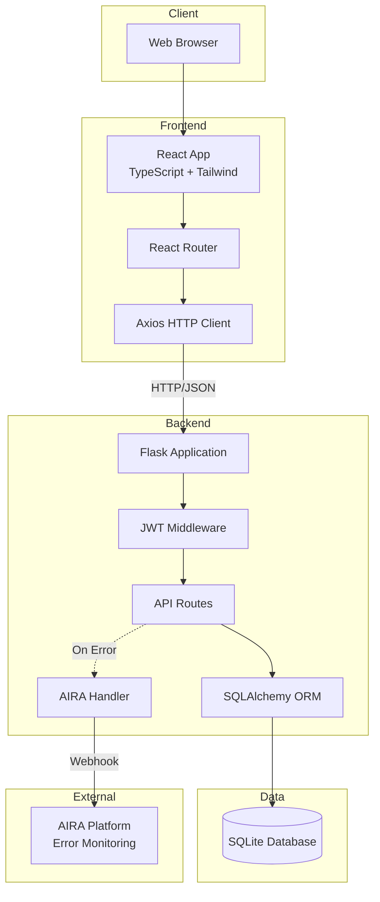

---

## 🔄 Request Flow with Error Handling

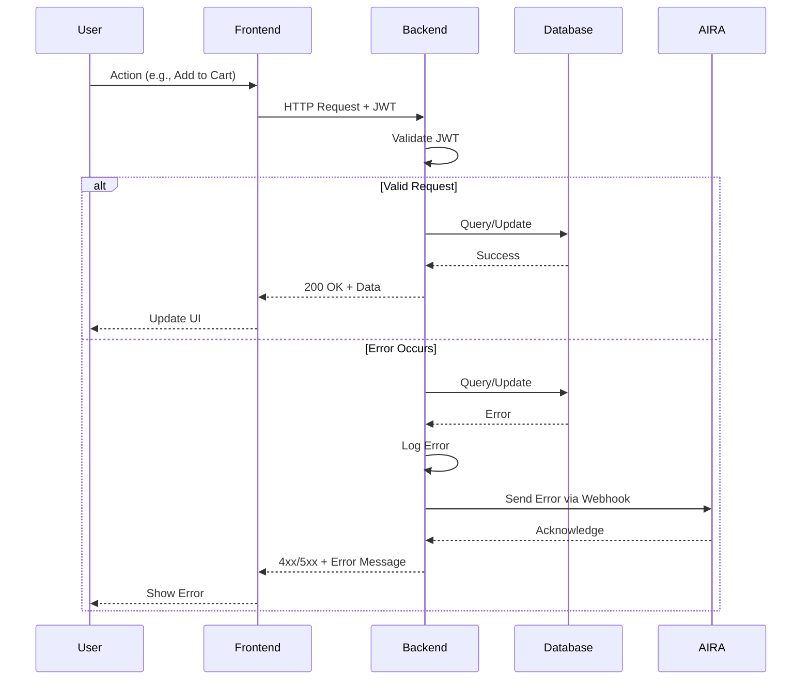

---

## 🚨 AIRA Error Capture Flow

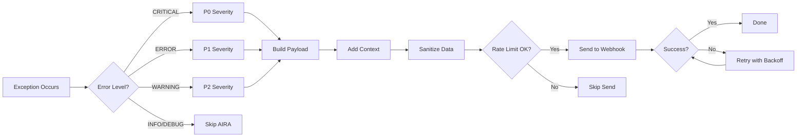

---

## 🔐 Authentication Flow

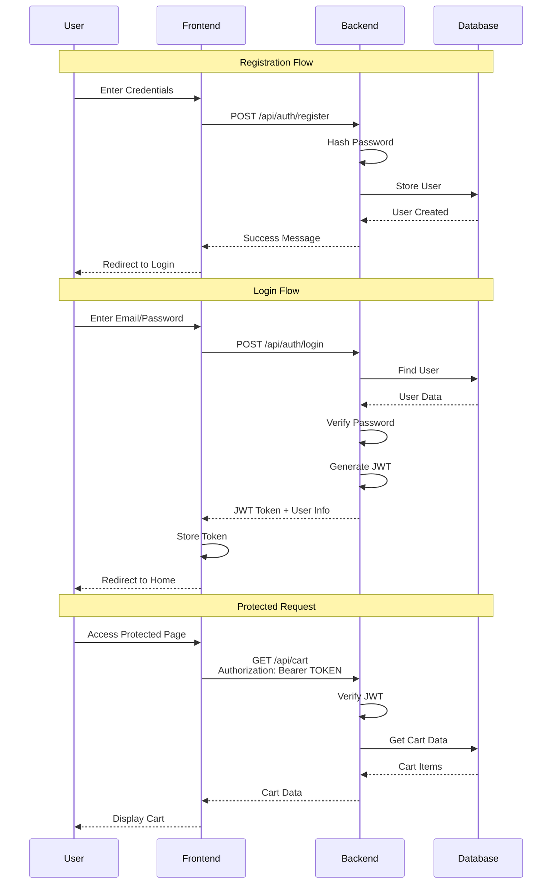

---

## 🛒 Shopping Cart Flow

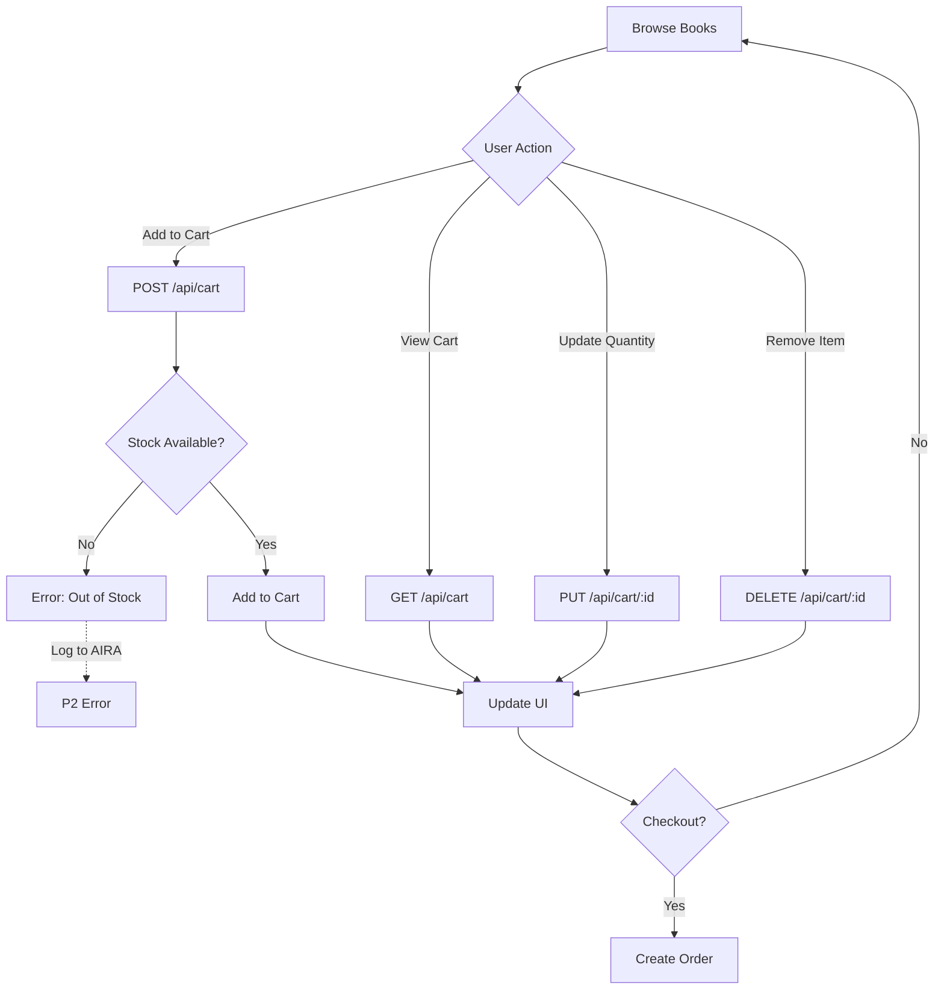

---

## 💳 Order Processing Flow

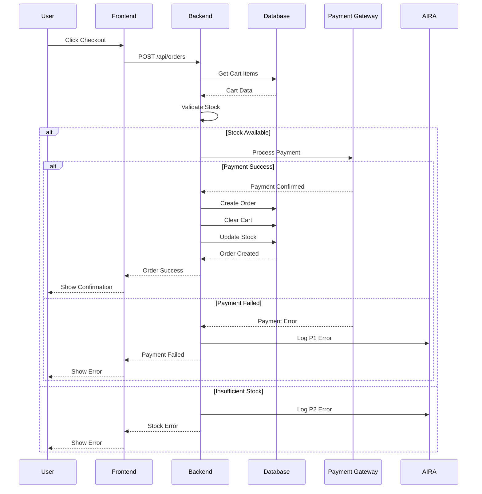

---

## 📊 Database Schema Relationships

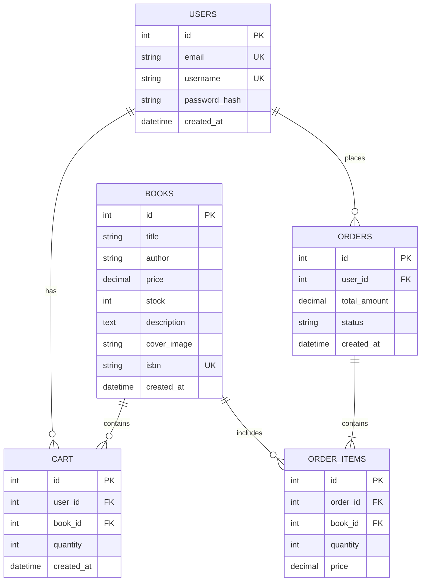

---

## 🧪 Error Testing Scenarios

```mermaid
graph TB
    A[Test Endpoints] --> B[P0: Database Error]
    A --> C[P1: Payment Error]
    A --> D[P1: Auth Error]
    A --> E[P2: Stock Error]
    A --> F[P2: Invalid ID]
    A --> G[P2: Validation Error]
    
    B --> H[/api/test/error/database]
    C --> I[/api/test/error/payment]
    D --> J[/api/test/error/auth]
    E --> K[/api/test/error/stock]
    F --> L[/api/books/99999]
    G --> M[/api/test/error/validation]
    
    H -.->|Logs to| N[AIRA Dashboard]
    I -.->|Logs to| N
    J -.->|Logs to| N
    K -.->|Logs to| N
    L -.->|Logs to| N
    M -.->|Logs to| N
    
    N --> O[View Errors]
    N --> P[Analyze Context]
    N --> Q[Review Stack Traces]
```

---

## 🔄 AIRA Handler Internal Flow

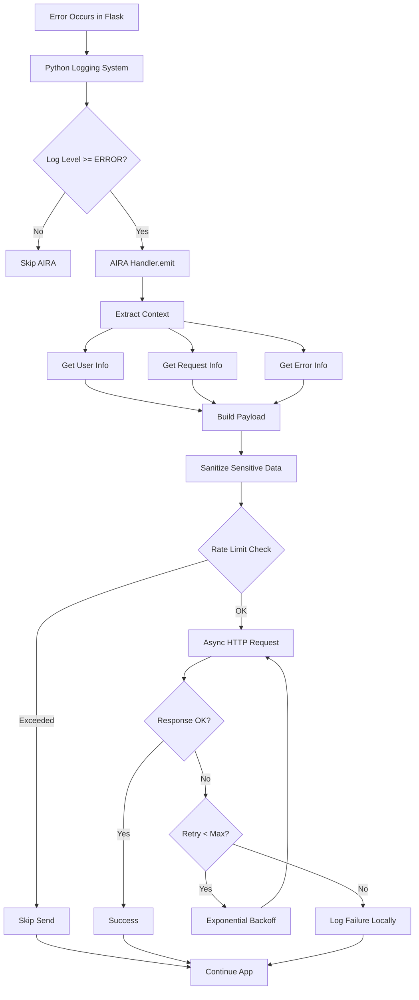

---

## 🎯 Component Interaction Map

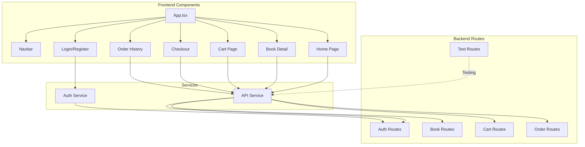

---

## 📱 Frontend State Management

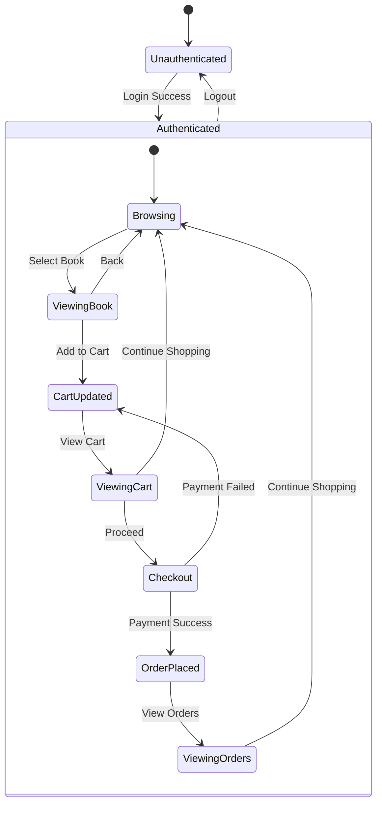

---

## 🔒 Security Layers

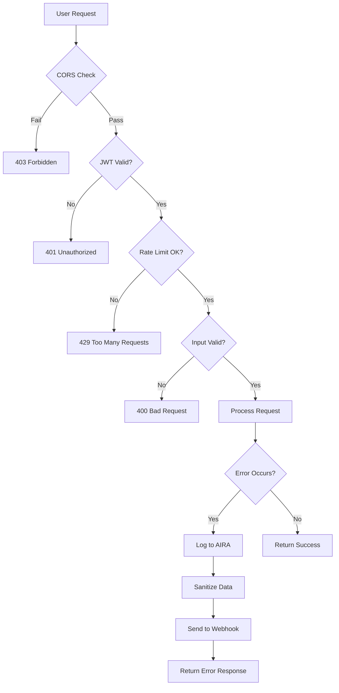

---

## 📈 Performance Considerations

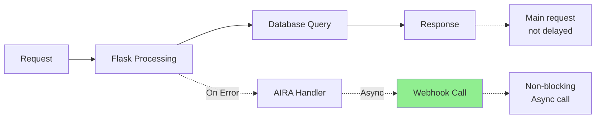

---

## 🎓 Learning Path

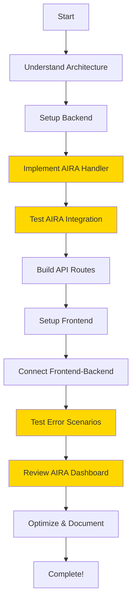

---

## 🚀 Deployment Architecture (Future)

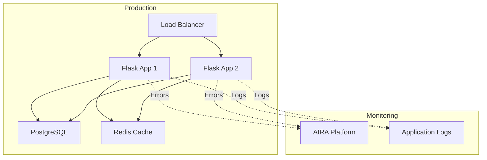

---

These diagrams provide visual representations of:
- System architecture
- Request flows
- Error handling
- Authentication
- Database relationships
- Component interactions
- Security layers
- Performance considerations

Use these diagrams to understand the system before implementation!